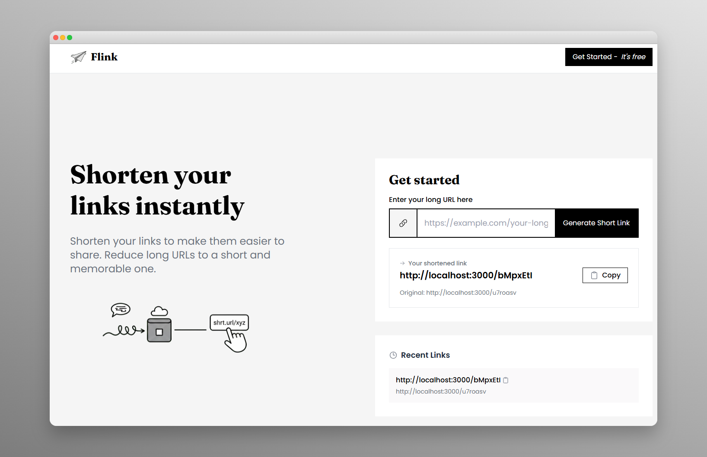

# Flink - URL Shortener



A minimal and modern URL shortener service built with React, Hono, Drizzle, PostgreSQL And Redis.

## Tech Stack

### Frontend
- **Vite** - Fast build tool and dev server
- **React 19** - UI library
- **TypeScript** - Type safety
- **Tailwind CSS** - Utility-first styling

### Backend
- **Hono** - Fast, lightweight web framework
- **TypeScript** - Type safety
- **Drizzle ORM** - Type-safe database ORM
- **PostgreSQL** - Relational database
- **Redis** - In-memory caching for fast redirects

### Tooling
- **pnpm** - Fast, disk-efficient package manager
- **Biome** - Fast linter and formatter
- **Docker** - Containerization for easy deployment

## Project Structure

```
flink/
├── apps/
│   ├── web/          # React frontend (Vite + Tailwind)
│   └── api/          # Hono backend + Drizzle ORM
├── docker/           # Docker configuration
├── docker-compose.yml
└── package.json
```

## Prerequisites

- Node.js 20+
- pnpm 9+
- Docker & Docker Compose (for database / production)

## Getting Started

### 1. Install Dependencies

```bash
pnpm install
```

### 2. Set Up Environment

Copy the example environment file:

```bash
cp .env.example .env
```

### 3. Start the Database and Redis

```bash
docker compose -f docker-compose.dev.yml up -d
```

This starts PostgreSQL and Redis for local development.

### 4. Run Database Migrations

```bash
pnpm db:generate
pnpm db:migrate
```

### 5. Start Development Servers

```bash
pnpm dev
```

This starts both the frontend (http://localhost:5173) and backend (http://localhost:3000).

## Available Scripts

| Script | Description |
|--------|-------------|
| `pnpm dev` | Start all apps in development mode |
| `pnpm dev:web` | Start only the frontend |
| `pnpm dev:api` | Start only the backend |
| `pnpm build` | Build all apps for production |
| `pnpm lint` | Run Biome linter |
| `pnpm lint:fix` | Fix linting issues |
| `pnpm format` | Format code with Biome |
| `pnpm db:generate` | Generate Drizzle migrations |
| `pnpm db:migrate` | Run database migrations |
| `pnpm db:studio` | Open Drizzle Studio (database GUI) |

## Docker Deployment

### Build and Run Everything

```bash
docker compose up --build
```

This will:
- Start PostgreSQL database
- Start Redis for caching
- Build and start the API server
- Build and serve the frontend via nginx

The application will be available at http://localhost

### Development with Docker (Database Only)

```bash
docker compose -f docker-compose.dev.yml up -d
```

Then run the apps locally with `pnpm dev`.

## API Endpoints

| Method | Endpoint | Description |
|--------|----------|-------------|
| `POST` | `/api/links` | Create a short link |
| `GET` | `/:shortCode` | Redirect to original URL |
| `GET` | `/health` | Health check |

### Create Short Link

```bash
curl -X POST http://localhost:3000/api/links \
  -H "Content-Type: application/json" \
  -d '{"url": "https://example.com/very-long-url"}'
```

Response:
```json
{
  "id": 1,
  "shortCode": "abc1234",
  "originalUrl": "https://example.com/very-long-url",
  "shortUrl": "http://localhost:3000/abc1234",
  "createdAt": "2026-02-01T12:00:00.000Z"
}
```

## Design Philosophy

Flink is intentionally simple. We prioritized a clean, frictionless experience over feature completeness.

### What we didn't add (and why)

- **No authentication** - Anyone can create short links instantly, no sign-up required
- **No link management dashboard** - Create a link, get the URL, done
- **No analytics** - We don't track clicks or collect user data
- **No custom short codes** - Random codes keep things simple and avoid conflicts
- **No expiration settings** - Links are permanent by default

These aren't missing features - they're deliberate tradeoffs. If you need user accounts, analytics, or link management, there are plenty of services that offer those. Flink is for when you just need to shorten a URL quickly.

## Technical Decisions

### Why Hono?
- Lightweight and fast
- Great TypeScript support
- Easy middleware composition

### Why Drizzle?
- Type-safe SQL queries
- Lightweight compared to Prisma
- SQL-like syntax (easy to understand)
- Great migration system

### Why PostgreSQL?
- Rock-solid reliability and ACID compliance
- Excellent indexing for fast short code lookups
- Battle-tested at scale
- Great tooling and community support
- Relational model makes it easy to add future features later (users, analytics, teams, etc.)

### Why nanoid for short codes?
- Configurable alphabet and length
- Better collision resistance than sequential IDs
- No external dependencies

### Why alphanumeric-only codes?
We use `A-Za-z0-9` instead of the default nanoid alphabet (which includes `_` and `-`):
- Easier to read, type, and share
- No confusion between `-` and `_`
- Better double-click selection in browsers
- Works better in emails and chat apps that sometimes break on special characters
- 62^7 = ~3.5 trillion combinations is still way more than enough

### Database Schema
- `links` table with indexed `short_code` for fast lookups

## Caching

Redis is used to cache URL redirects for improved performance:

- **Cache-first strategy**: Redirects check Redis before hitting the database
- **TTL**: Cached entries expire after 1 hour

## Security Considerations

- URL validation to prevent malicious links
- Rate limiting to prevent abuse (10 requests per minute per IP, sliding window via Redis)
- CORS configured for specific origins
- No sensitive data stored (short codes are not secrets)

## Built With AI

This project was built using [Cursor](https://cursor.com) with Claude Opus 4.5. The [Hono Routing Skill](https://skills.sh/jezweb/claude-skills/hono-routing) was used. 
I also used AI as inspiration or to challenge my patterns.


## License

MIT
